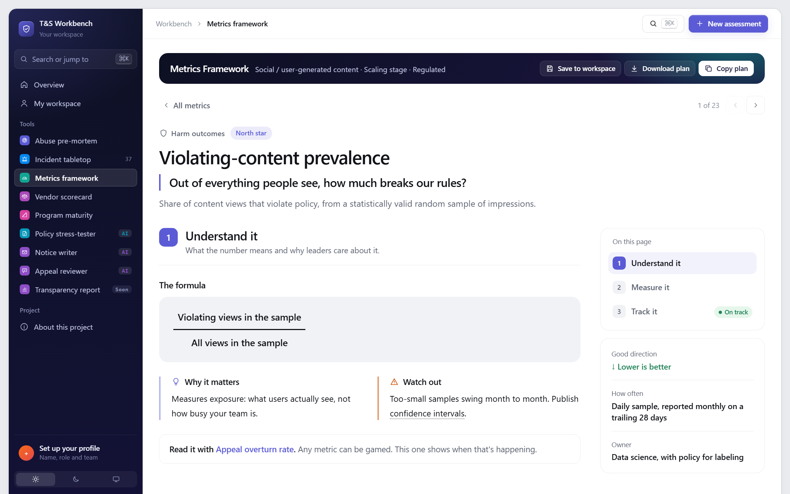
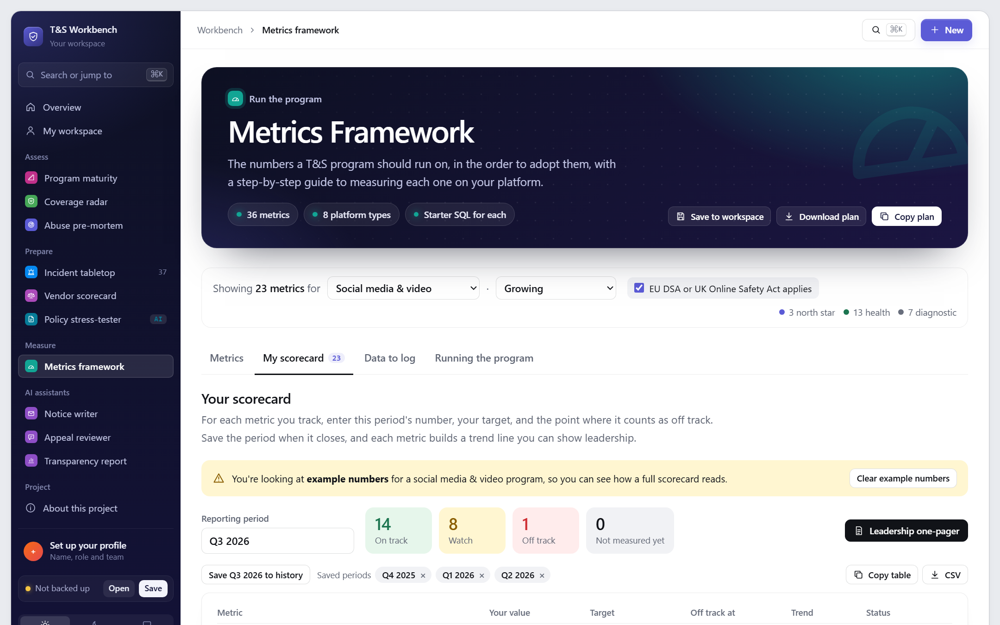
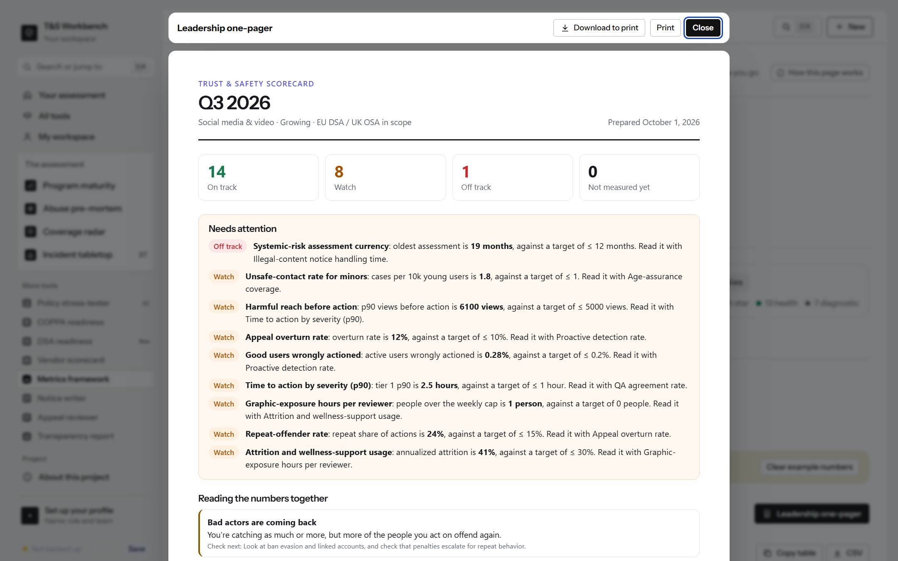

# T&S Metrics Framework

> **Is our Trust & Safety program actually making people safer, and how would we prove it?**

36 metrics in the order to adopt them. Each comes with the question it answers, a formula, step-by-step measurement for 8 kinds of platform, a starter SQL query and a spreadsheet version for teams without a data team. Track your own numbers, trends over time and a leadership one-pager.

**[Try it live](https://stevenmacchia.com/ts-workbench/#metrics)** · part of [T&S Workbench](https://github.com/stevenmacchia/ts-workbench) · free, no sign-up

## The problem

Trust & Safety teams often report what's easy to count, like items removed or reports received, instead of what matters: how much harm users actually see, how often decisions are wrong and how fast the worst cases are handled. Almost nothing teaches how to produce the better metrics.

## How it works

1. **Pick your platform and stage.** The list adapts: north stars first, then health metrics, then diagnostics.
2. **Open a metric.** Understand it, measure it and track it, with jargon explained on hover.
3. **Track your numbers.** Targets, status, trends across periods and a one-pager for leadership.

## What's in this repo

The tool's knowledge, published as open content you can read, reuse and adapt.

| File | What it is |
|---|---|
| [`metrics/`](metrics/) | 36 metric pages: question, formula, steps, platform notes, SQL, example and a no-data-team version |
| [`data-to-log.md`](data-to-log.md) | The event logs every metric depends on |
| [`running-the-program.md`](running-the-program.md) | Review rhythm, target setting and vanity metrics to avoid |
| [`glossary.md`](glossary.md) | Plain-language definitions |
| [`data/metrics.json`](data/metrics.json) | Everything as JSON |

## Use it for

- Designing a T&S scorecard from scratch
- Quarterly business reviews and board updates
- Scoping work for a data scientist or analyst
- Preparing transparency reporting

## More screenshots

## License and credit

Content in this repo is licensed [CC BY 4.0](LICENSE): reuse and adapt it freely, with credit. The tool's source code is in [ts-workbench](https://github.com/stevenmacchia/ts-workbench) under the MIT license.

Built by [Steven Macchia](https://www.linkedin.com/in/stevenmacchia), Trust & Safety leader, with AI-assisted development (Claude).
